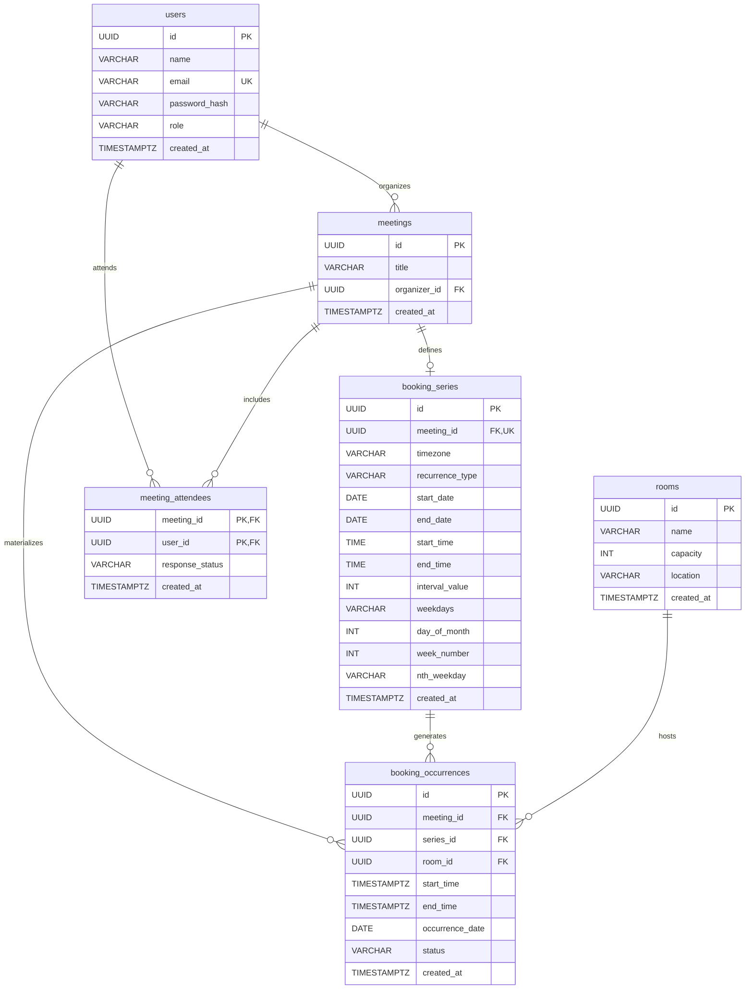

# Entity Relationship Specification — RoomBooker

```mermaid
erDiagram
    users {
        UUID id PK
        VARCHAR name
        VARCHAR email UK
        VARCHAR password_hash
        VARCHAR role
        TIMESTAMPTZ created_at
    }

    rooms {
        UUID id PK
        VARCHAR name
        INT capacity
        VARCHAR location
        TIMESTAMPTZ created_at
    }

    meetings {
        UUID id PK
        VARCHAR title
        UUID organizer_id FK
        TIMESTAMPTZ created_at
    }

    meeting_attendees {
        UUID meeting_id PK,FK
        UUID user_id PK,FK
        VARCHAR response_status
        TIMESTAMPTZ created_at
    }

    booking_series {
        UUID id PK
        UUID meeting_id FK,UK
        VARCHAR timezone
        VARCHAR recurrence_type
        DATE start_date
        DATE end_date
        TIME start_time
        TIME end_time
        INT interval_value
        VARCHAR weekdays
        INT day_of_month
        INT week_number
        VARCHAR nth_weekday
        TIMESTAMPTZ created_at
    }

    booking_occurrences {
        UUID id PK
        UUID meeting_id FK
        UUID series_id FK
        UUID room_id FK
        TIMESTAMPTZ start_time
        TIMESTAMPTZ end_time
        DATE occurrence_date
        VARCHAR status
        TIMESTAMPTZ created_at
    }

    users ||--o{ meetings : "organizes"
    users ||--o{ meeting_attendees : "attends"
    meetings ||--o{ meeting_attendees : "includes"
    meetings ||--o| booking_series : "defines"
    meetings ||--o{ booking_occurrences : "materializes"
    booking_series ||--o{ booking_occurrences : "generates"
    rooms ||--o{ booking_occurrences : "hosts"
```
