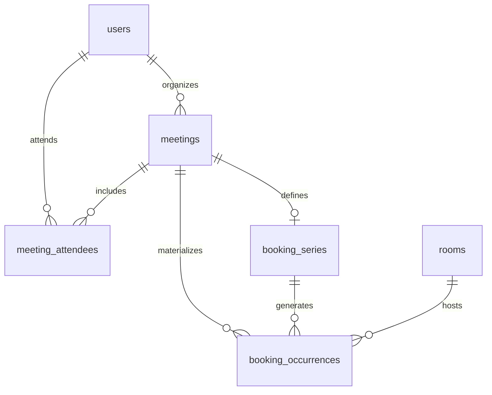

# RoomBooker — Recurring Meeting Room Booking System

[](https://oracle.com/java/)
[](https://spring.io/projects/spring-boot)
[](https://www.postgresql.org/)
[](https://redis.io/)
[](https://www.docker.com/)

Production-grade backend service built with **Java 21, Spring Boot 3, PostgreSQL, Redis, Flyway, and Docker** for managing meeting room reservations, supporting **one-off bookings, recurring bookings (Daily, Weekly, Monthly date/nth-weekday), timezone/DST-aware occurrence expansion, $O(k \log n)$ conflict detection, and series editing (`THIS`, `THIS_AND_FUTURE`, `WHOLE_SERIES`)**.

---

## Key Features

- **JWT Authentication & Authorization**: Role-based access control (`USER`, `ADMIN`) using stateless Spring Security + JWT.
- **One-Off & Recurring Bookings**: Full support for single reservations and recurrence rules (Daily, Weekly multi-day, Monthly fixed-day, Monthly Nth-weekday).
- **Timezone & DST Correctness**: Stores occurrences as absolute UTC `Instant` values while generating recurrence in the user's local `ZoneId`. Automatically detects and rejects DST spring-forward gap times (`InvalidMeetingTimeException`).
- **Conflict Detection Engine**: Half-open interval `[start, end)` checking using indexed PostgreSQL range queries (`idx_booking_occurrences_room_start`, `idx_booking_occurrences_room_end`).
- **All-or-Nothing Atomic Series Creation**: If any occurrence in a 50-occurrence series conflicts, the transaction rolls back completely and reports exact conflicting dates and times.
- **Series Editing**: Flexible scope modifications (`THIS`, `THIS_AND_FUTURE`, `WHOLE_SERIES`) with clean series splitting.
- **Redis Caching**: Caches room metadata with 10-minute TTL and automated eviction on write (`@CacheEvict`). Degrades gracefully to DB if Redis is offline.
- **Spring Actuator Monitoring**: Operational visibility at `/actuator/health`, `/actuator/metrics`, and `/actuator/prometheus`.
- **OpenAPI / Swagger UI**: Built-in interactive documentation at `/swagger-ui.html`.

---

## Core Invariant & Mathematical Conflict Rule

For any room $R$, no two active (`CONFIRMED`) booking occurrences $B_1$ and $B_2$ can overlap:

$$\text{Overlap}(B_1, B_2) \iff (B_1.\text{startTime} < B_2.\text{endTime}) \land (B_1.\text{endTime} > B_2.\text{startTime})$$

Adjacency is explicitly permitted: a meeting ending at `11:00 UTC` does not conflict with a meeting starting at `11:00 UTC`.

---

## Tech Stack

| Layer | Technology |
|---|---|
| **Language** | Java 21 |
| **Framework** | Spring Boot 3.4.3 |
| **Security** | Spring Security 6 + JJWT |
| **Database** | PostgreSQL 17 |
| **ORM / Persistence** | Spring Data JPA / Hibernate |
| **Database Migrations** | Flyway |
| **Caching** | Redis 7 + Spring Data Redis |
| **Monitoring** | Spring Boot Actuator |
| **API Documentation** | Springdoc OpenAPI (Swagger UI) |
| **Build & Containerization** | Maven, Docker, Docker Compose |

---

## Database ER Diagram Summary



For full DDL schema and foreign keys, see [ER_DIAGRAM.md](file:///c:/Users/ABHILASH%20REDDY/projects/roombooker/ER_DIAGRAM.md).

---

## Complexity Analysis

Let $k$ be the number of occurrences generated for a series (bounded by 12 months) and $n$ be the total number of existing bookings in the database for the room.

- **Occurrence Expansion**: $O(k)$ time complexity.
- **Conflict Query**: $O(k \log n)$ time using B-tree composite index `(room_id, start_time, end_time)`.
- **Space Complexity**: $O(k)$ persisted rows in `booking_occurrences`.

---

## Quick Start (Running via Docker Compose)

### 1. Clone & Build
```bash
docker compose up -d --build
```

### 2. Verify Services
- **Spring Boot API**: http://localhost:8080
- **Swagger UI**: http://localhost:8080/swagger-ui.html
- **Actuator Health**: http://localhost:8080/actuator/health

---

## API Summary

| Method | Endpoint | Description |
|---|---|---|
| `POST` | `/api/v1/auth/register` | Register user & get JWT token |
| `POST` | `/api/v1/auth/login` | Authenticate & get JWT token |
| `GET` | `/api/v1/rooms` | List all meeting rooms (Redis Cached) |
| `POST` | `/api/v1/rooms` | Create meeting room (ADMIN) |
| `POST` | `/api/v1/bookings` | Create one-off room booking |
| `POST` | `/api/v1/bookings/recurring` | Create recurring booking series |
| `GET` | `/api/v1/bookings/occurrences?roomId=...` | Search occurrences by date range |
| `PATCH` | `/api/v1/bookings/series/{seriesId}` | Edit series (`THIS`, `THIS_AND_FUTURE`, `WHOLE_SERIES`) |
| `DELETE` | `/api/v1/bookings/occurrences/{id}` | Cancel single occurrence |
| `DELETE` | `/api/v1/bookings/series/{seriesId}` | Cancel entire recurring series |

For full details, see [API.md](file:///c:/Users/ABHILASH%20REDDY/projects/roombooker/API.md).

---

## Testing

Run unit & integration test suite:
```bash
./mvnw test
```
Tests cover:
- Daily, Weekly (multi-day), Monthly date & Nth-weekday recurrence.
- DST spring-forward gap detection and fall-back overlap resolution.
- Half-open interval conflict detection $[start, end)$.
